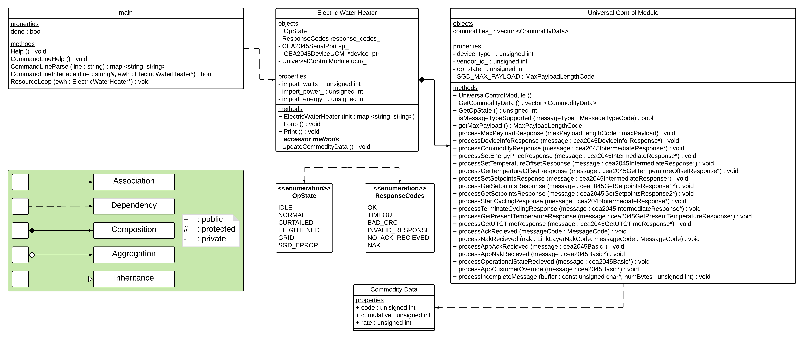

# EWH
Electric Water Heater Controller

## Dependancies
### Linux Environment
``` console
sudo apt-get update
sudo apt-get upgrade
sudo apt-get install git build-essential gcc g++ cmake make xsltproc scons doxygen graphviz libgtk2.0-dev libssl-dev libxml2-dev libcap-dev
mkdir ~/dev ~/src
```
### EPRI-CTA2045
``` console
cd ~/src
git clone https://github.com/epri-dev/CTA-2045-UCM-CPP-Library
cd CTA-2045-UCM-CPP-Library
```

#### Build
``` console
mkdir -p build/debug
cd build/debug
cmake -DCMAKE_BUILD_TYPE=Debug -DSAMPLE=1 -DTEST=1 ../../
make
```

#### Test
``` console
./testcea2045
```

If the response is All tests passed, then you are ready to move forward. If not, please reference the EPRI documentation for the CTA-2045 repository. 

## Install
``` console
cd ~/dev
git clone https://github.com/Tylores/EWH
```

### Setup
1. Open /EWH/tools/build-run.sh
2. Modify "CPU" to reflect the system you are working on
3. Ensure "CTA_ROOT" is correct

``` console
cd ~/dev/EWH/tools
./build-run.sh
```
## Use
The program can be controlled two ways:
1. The method handlers built into the "Smart Grid Device" that execute when an AllJoyn method call is recieved.
2. The Command Line Interface (CLI).

```
        [Help]
> q             quit
> h             help
> i             import power
> e             export power
> p             print properties
```

## Class UML

<p align="center">
  
</p>
